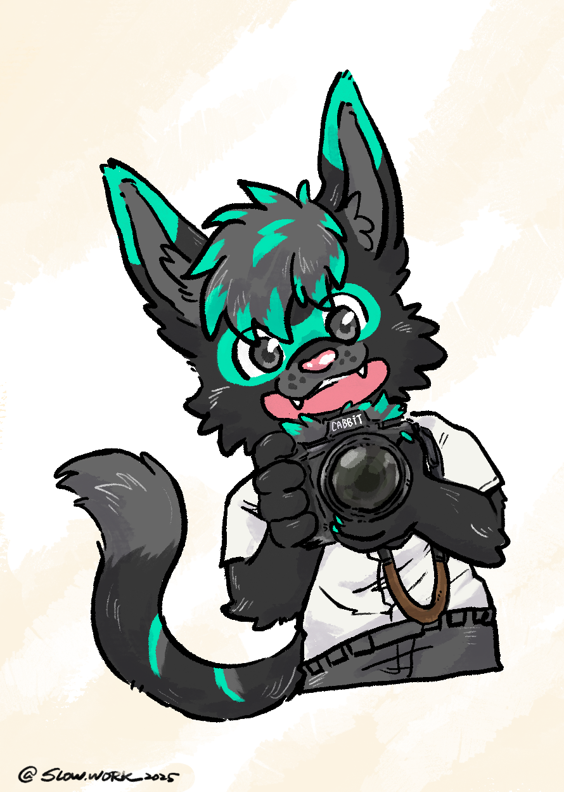

# Hiiii! I'm Turquo it's really nice to see you here!

<figcaption>
<a href="https://slow.work/" target="_blank"> @Slow.work</a>
</figcaption>

 

* [Facebook](https://www.facebook.com/turquoCabbit) {Chinese}
* [X](https://twitter.com/Turquobitbit) {English}
* [Plurk](https://www.plurk.com/night5916lan) {Chinese}
* [Twitch](https://www.twitch.tv/turquocabbit)
* [Telegram](https://t.me/night5916lan)
* [Flickr Album](https://www.flickr.com/photos/197896838@N03/albums/)

---
* Interests & Scope
    * Primarily use Chinese/English, slowly learning Japanese right now  

    * Photography
        * [Flickr Album](https://www.flickr.com/photos/197896838@N03/albums/)
        * Start shooting photo with camera after Infurnity2023
            * ~~[Nikon Z6II](https://imaging.nikon.com/imaging/lineup/mirrorless/z_6_2/) (20231128)~~
            * [NIKKOR Z 24-120mm F4 S](https://imaging.nikon.com/imaging/lineup/lens/z-mount/z_24-120mmf4s/) (20231128)
            * ~~[NIKKOR Z 40mm F2 SE](https://imaging.nikon.com/imaging/lineup/lens/z-mount/z_40mmf2_se/)~~
            * ~~[NIKKOR Z 85mm F1.8 S](https://imaging.nikon.com/imaging/lineup/lens/z-mount/z_85mmf18s/)~~
            * [NIKKOR Z 50mm F1.8 S](https://imaging.nikon.com/imaging/lineup/lens/z-mount/z_50mmf18s/) (20250818)
            * [Nikon Z6III](https://imaging.nikon.com/imaging/lineup/mirrorless/z6_3/) (20251016) 

    * Fantasy/Sci-Fi and Wuxia Literature
        * Favorite Series
            * The Stormlight Archive (or perhaps the entire [Cosmere](https://www.brandonsanderson.com/)?)
            * Farseer trilogy
            * The Witcher
            * Hyperion Cantos
            * The Wheel of Time
        * Also trying to create my own work 

    * Audiophile
        * Current Gear:
            * Headphones:
                1. [Dan Clark ÆON 2 Noire](https://danclarkaudio.com/aeon-2-noir.html)
                2. [HD6XX](https://drop.com/buy/massdrop-sennheiser-hd6xx)
                3. [UE 11Pro](https://pro.ultimateears.com/products/ue-11-pro)
            * Source/DAC/AMP
                1. [ZEN DAC V2](https://ifi-audio.com/)
                2. [Topping A90](https://www.tpdz.net)

        * Log/History:
            * 2017/07 [m-DAC mini](https://www.audiolab.co.uk/mdac-mini/) driving [DT770 pro 250Ω](https://europe.beyerdynamic.com/dt-770-pro.html)
            * 2019/05 [Keces S3](https://www.kecesaudio.com/ch/S3.html) driving [T1 2nd](https://global.beyerdynamic.com/t1.html)
            * 2020/08 Ordered [UE 11Pro](https://pro.ultimateears.com/products/ue-11-pro)
            * 2020/08 Purchased [Fiio BTR5](https://fiio.com/btr5)
            * 2020/12 Purchased a [HanSound Aegis](http://www.hansoundaudio.com/Product_Detail.aspx?BigClassID=00000000-0000-0000-0000-000000000000&ClassID=50d0655e-c3f9-4304-92a7-e21418bd23ff&ID=81632ecf-ae85-4854-8ac0-5d2c11808df0) balanced cable
            * 2021/04 Purchased [HD6XX](https://drop.com/buy/massdrop-sennheiser-hd6xx)
            * 2021/05 Sold [Fiio BTR5](https://fiio.com/btr5), replaced with [A&K Kann Alpha](https://www.astellnkern.com/product/product_detail.jsp?productNo=7)
            * 2022/01 Purchased [Dan Clark ÆON 2 Noire](https://danclarkaudio.com/aeon-2-noir.html)
            * 2022/01 Purchased [Topping A90](https://www.tpdz.net)
            * 2022/04 Sold [A&K Kann Alpha](https://www.astellnkern.com/product/product_detail.jsp?productNo=7)
            * 2022/05 Purchased [SMSL SU-9](https://smsl-audio.com)
            * 2025/08 Sold [SMSL SU-9](https://smsl-audio.com) 

    * What I Listen To
        * Classical: from Concertos to Symphony
        * J-Rock, love the sound of Japanese electric guitars
        * Western Oldies/Rock (70's~90's)
        * Mandarin/Taiwanese Oldies
        * Movie/Game Soundtracks
        * Epic Music 

    * Coffee Lover
        * My grinder is [1Zpresso X-Pro](https://1zpresso.com/xpro/), to which I've added a custom [electric mod](https://www.plurk.com/p/p73ac5)
        * Currently brewing with [V60 02](https://www.hario.com.tw/?product=v60%e9%80%8f%e6%98%8e02%e6%a8%b9%e8%84%82%e6%bf%be%e6%9d%af)
            * Light to medium Roast
            * Water-to-Coffee Ratio: 1:15
            * Water Temperature: 93°C
        * Also using an [AeroPress](https://aeropress.com/)
            * My Recipe:
                1. 16g of beans, ground to near-espresso fineness
                2. Use the inverted method with the AeroPress
                3. Wet the filter paper with hot water, then start timing
                4. Pour in 100g of 85°C hot water, stir well
                5. Cap it to push out air, steep for 100 seconds
                6. Flip and press the coffee out, then add 180g of fresh milk to drink 

    * Movies
        * Watch any film (blockbuster or indie) that sparks my interest
        * I don't watch horror films, I hate being jump scared 

    * Indexing Investment
        * [Bogleheads Three-fund portfolio](https://www.bogleheads.org/wiki/Three-fund_portfolio) 

    * Love memes 

    * Love Dad jokes 

* My OCs
    * Turquo
        * [TG sticker pack](https://t.me/addstickers/turquo_cabbit)
        * Cabbit type
        

        
        <figcaption>
        <a href="https://www.facebook.com/puiidrgonthevelociraptor" target="_blank"> @妞龍</a>
        </figcaption>
        
 

        * Bunny type
        

        
        <figcaption>
        <a href="https://susey3377.wixsite.com/visionalbird" target="_blank"> @無鳥</a>
        </figcaption>
        
 

    
    * Crema
        * [TG sticker pack](https://t.me/addstickers/cremac)
        * Border Collie
        

        
        <figcaption>
        <a href="https://www.facebook.com/hu.mu.737173" target="_blank"> @狐睦</a>
        </figcaption>
        
 
        

    * 上官晦璃
        * Dragon
        

        
        <figcaption>
        <a href="https://www.facebook.com/mixdog018" target="_blank"> @DOG</a>
        </figcaption>
        
 

---
* [Facebook](https://www.facebook.com/turquoCabbit) {Chinese}
* [X](https://twitter.com/Turquobitbit) {English}
* [Plurk](https://www.plurk.com/night5916lan)
* [Twitch](https://www.twitch.tv/turquocabbit)
* [Telegram](https://t.me/night5916lan)
* [Flickr Album](https://www.flickr.com/photos/197896838@N03/albums/)