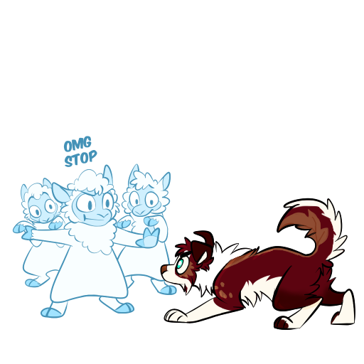

# PLUEX 貼圖模板填色委託

## 提供各種族[PLUEX貼圖模板](https://www.pulexart.com/store.html)的填色委託

### ⚠️ 重要注意事項 ⚠️

* 依據[PLUEX 貼圖模板 TOS](https://www.pulexart.com/sticker-bases-tos.html)所提：
    1. **委託者**與填色者皆需自行購買模板
    2. 可以用於各社交平台、通訊軟體等，使用時必須註明出處（用於TG貼圖包時可於貼圖包內加上此[出處貼圖](./pic/credit-sticker-pulexart-2025.png)）
        

        
        <figcaption>
        <a href="https://www.pulexart.com" target="_blank"> pulexart</a>
        </figcaption>
    3. 委託人後續以此成品製成的印刷品、模型等現實與數位衍生物品，皆僅供個人與非商業用途使用

### 委託細項
* 填色一張貼圖新台幣 200元
* 一包[PLUEX貼圖模板](https://www.pulexart.com/store.html)至少需挑選6張貼圖進行填色（貼圖模板包內貼圖張數少於6張者不受此限）
* 可以跨多包挑選貼圖進行填色，僅需遵守如上規則
* 若角色設定複雜或需要修改線稿，每張視情況加收新台幣50到100元，或是與我進行討論將設定做簡化表示

---

### 流程
  1. 委託人至[PLUEX貼圖模板](https://www.pulexart.com/store.html)挑選預委託填色的貼圖與數量予我
  2. 我會與委託人討論角色設定圖樣是否需要加價或簡化之處，並提供填色委託的總價讓委託人確認
      * 若委託的角色設定我實在沒有把握可以做出好的呈現，我在此階段即會叫停，造成不便請見諒
  3. 委託人同意進行委託後，契約即成立
  4. 我將此筆委託排入工作事項中並購買貼圖模板
  5. 填色全部完成後我會提供有浮水印的檔案予委託人確認，若填色與角色設定有誤請於此階段提出
  6. 委託人確認無誤後會提供收款銀行帳號讓委託人進行付款
  7. 款項確認無誤後，即會提供無浮水印版的貼圖檔案給委託人，委託流程到此結束
      * 512 * 512 解析度之背景透明的PNG檔案
      * 壓縮資料夾內會包含[出處貼圖](./pic/credit-sticker-pulexart-2025.png)檔案

---

### 填色範例

[TG Crema Pack](https://t.me/addstickers/cremac)

